# Project Testing

## Testing Methods

This project was primarily tested manually however there was a small number of basic automated tests created primarily focused on acess to urls locked behind authentication and testing of the forms created also. In addition to the manual tests, you can also find the results of the code validation here.

## Automated Testing

As mentioned in the introduction, a small number of automated tests were created primarily focused on user authentication and form validation. I also tested the views to ensure that the correct responses were received

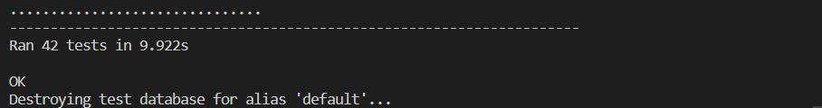

## Manual Testing

A large amount of manual testing was performed to ensure that user's did not experience any unintended consequences when browsing the site. The testing has been broken down to actions that could be performed in each section of the site and the expected results.

### Navbar

Feature Tested | Expected Result | Actual Result | Pass/Fail
---------------|-----------------|---------------|----------
Navbar becomes hamburger menu on page resize | Navbar becomes hamburger menu on page resize | As expected | Pass
When in responsive mode, hamburger menu closes when clicked on if open | When in responsive mode, hamburger menu closes when clicked on if open | As expected | Pass
All links in navbar work and link to the correct pages | All links in navbar work and link to the correct pages | As expected | Pass
When using search the search terms are correctly passed to the IGDB API and return the search results in the correct page and paginated appropriately | When using search the search terms are correctly passed to the IGDB API and return the search results in the correct page and paginated appropriately | As expected | Pass
Sign-In/Sign-Up buttons are not displayed when user logs in | Sign-In/Sign-Up buttons are not displayed when user logs in | As expected | Pass
Username is displayed in navbar when user is logged in | Username is displayed in navbar when user is logged in | As expected | Pass

### Footer

Feature Tested | Expected Result | Actual Result | Pass/Fail
---------------|-----------------|---------------|----------
Footer links all work when clicked | Footer links all work when clicked | As expected | Pass
Footer links switch to column display on mobile devices | Footer links switch to column display on mobile devices | As expected | Pass

### All Pages

Feature Tested | Expected Result | Actual Result | Pass/Fail
---------------|-----------------|---------------|----------
Pages respond correctly on mobile and don't exceed the field of view | Pages respond correctly on mobile and don't exceed the field of view | As expected | Pass
Images resize on mobile as intended | Images resize on mobile as intended | As expected | Pass
When user signs out, they are returned to homepage with sign-in/sign-up buttons returned to navbar | When user signs out, they are returned to homepage with sign-in/sign-up buttons returned to navbar | As expected | Pass
If a game does not have a cover image provided, the default 'No Cover Available' image is displayed instead | If a game does not have a cover image provided, the default 'No Cover Available' image is displayed instead | As expected | Pass
Favicon is correctly display on all browsers/devices | Favicon is correctly display on all browsers/devices | As expected | Pass
Pagination works successfully when number of items on page exceeds the limit set | Pagination works successfully when number of items on page exceeds the limit set | As expected | Pass

### Home Pages

Feature Tested | Expected Result | Actual Result | Pass/Fail
---------------|-----------------|---------------|----------
When accessing home page query is run for recently released and soon to be released games and displayed in the appropriate section | When accessing home page query is run for recently released and soon to be released games and displayed in the appropriate section | As expected | Pass
When user is logged in, recently viewed games carousel is displayed below navbar if they have viewed at least one game | When user is logged in, recently viewed games carousel is displayed below navbar if they have viewed at least one game | As expected | Pass
When number of recently viewed games exceeds the number set for the display in use, carousel controls are activated and allow user to see more images | When number of recently viewed games exceeds the number set for the display in use, carousel controls are activated and allow user to see more images | As expected | Pass
Number of images displayed in image carousels correctly changes when viewing on mobile devices | Number of images displayed in image carousels correctly changes when viewing on mobile devices | As expected | Pass
Layout switches to single column on mobile | Layout switches to single column on mobile | As expected | Pass

### Genre/Developer/Publisher Lists

Feature Tested | Expected Result | Actual Result | Pass/Fail
---------------|-----------------|---------------|----------
Alphabetical anchor links correctly link to the correct section of the page when clicked | Alphabetical anchor links correctly link to the correct section of the page when clicked | As expected | Pass
Clicking on any of the genre/developer/publisher links correctly returns a list containing the games in those categories | Clicking on any of the genre/developer/publisher links correctly returns a list containing the games in those categories | As expected | Pass

### Genre/Developer/Publisher Items

Feature Tested | Expected Result | Actual Result | Pass/Fail
---------------|-----------------|---------------|----------
Average review score is correctly calculated and displayed to users | Average review score is correctly calculated and displayed to users | As expected | Pass

### Game Description Page

Feature Tested | Expected Result | Actual Result | Pass/Fail
---------------|-----------------|---------------|----------
Add to collection/Remove from collection buttons are not shown when user is not logged in | Add to collection/Remove from collection buttons are not shown when user is not logged in | As expected | Pass
Add to collection is not shown when the user has not created any collections | Add to collection is not shown when the user has not created any collections | As expected | Pass
Remove from collection button is not displayed when game is not part of collection | Remove from collection button is not displayed when game is not part of collection | As expected | Pass
Adding to personal collection correctly adds to user's personal collection | Adding to personal collection correctly adds to user's personal collection | As expected | Pass
If game is in personal collection, button is replaced with notification of that status | If game is in personal collection, button is replaced with notification of that status | As expected | Pass
Options to leave a review/reply to a review are only shown to signed in users | Options to leave a review/reply to a review are only shown to signed in users | As expected | Pass
If user chooses to leave a review/comment, the form section correctly expands | If user chooses to leave a review/comment, the form section correctly expands | As expected | Pass
When review is left, review rating is correctly added to the review score and the average is updated accordingly | When review is left, review rating is correctly added to the review score and the average is updated accordingly | As expected | Pass
Prompt to edit/delete a reply/comment are correctly shown to only the author | Prompt to edit/delete a reply/comment are correctly shown to only the author | As expected | Pass
If editing content, if a user provides invalid content they are returned to the game page | If editing content, if a user provides invalid content they are returned to the game page | As expected | Pass
If editing content, if user provides valid content they are returned to the game page with their edited content updated | If editing content, if user provides valid content they are returned to the game page with their edited content updated | As expected | Pass
User is prompted to confirm deletion when deleting a review/comment | User is prompted to confirm deletion when deleting a review/comment | As expected | Pass
If game selected is part of a collection or multiple, a selection of those are shown to the user at the bottom of the page | If game selected is part of a collection or multiple, a selection of those are shown to the user at the bottom of the page | As expected | Pass

### Sign-In/Sign-Up/Password Change Forms

Feature Tested | Expected Result | Actual Result | Pass/Fail
---------------|-----------------|---------------|----------
When user inputs invalid information in sign-in, sign-up or password change forms they are prompted to provide correct information | When user inputs invalid information in sign-in, sign-up or password change forms they are prompted to provide correct information | As expected | Pass

### Error Pages

Feature Tested | Expected Result | Actual Result | Pass/Fail
---------------|-----------------|---------------|----------
If user attempts to access page they are not authorised for they are provided a 403 page | If user attempts to access page they are not authorised for they are provided a 403 page | As expected | Pass
If user attempts to access invalid URL a 404 error page is displayed | If user attempts to access invalid URL a 404 error page is displayed | As expected | Pass
If user encounters a server error a 500 error page is displayed | If user encounters a server error a 500 error page is displayed | As expected | Pass

### Profile Pages

Feature Tested | Expected Result | Actual Result | Pass/Fail
---------------|-----------------|---------------|----------
When user updates profile picture it is correctly updated in any reviews they have left | When user updates profile picture it is correctly updated in any reviews they have left | As expected | Pass
Clicking on update profile correctly links to profile update form | Clicking on update profile correctly links to profile update form | As expected | Pass
After updating profile, if form data is valid they are returned to profile page with updated information displayed | After updating profile, if form data is valid they are returned to profile page with updated information displayed | As expected | Pass
Clicking on update password correctly links to password update form | Clicking on update password correctly links to password update form | As expected | Pass
After updating password, if form data is valid they are returned to profile page with the session data updated with new password | After updating password, if form data is valid they are returned to profile page with the session data updated with new password | As expected | Pass
If password update form contains invalid data they are prompted to correct the form with the correct information | If password update form contains invalid data they are prompted to correct the form with the correct information | As expected | Pass

### My Personal Collection

Feature Tested | Expected Result | Actual Result | Pass/Fail
---------------|-----------------|---------------|----------
Only games added to personal collection are listed | Only games added to personal collection are listed | As expected | Pass
Removing game from collection correctly removes the chosen game | Removing game from collection correctly removes the chosen game | As expected | Pass
Images in collection correctly resize on mobile | Images in collection correctly resize on mobile  | As expected | Pass

### My Collections

Feature Tested | Expected Result | Actual Result | Pass/Fail
---------------|-----------------|---------------|----------
User accessing their collections page is shown the list of their currently created collections | User accessing their collections page is shown the list of their currently created collections | As expected | Pass
When user publishes a collection it becomes available in All Collections page and recently created if applicable | When user publishes a collection it becomes available in All Collections page | As expected | Pass
When user unpublishes a collection it is removed from All Collections page and recently created if applicable | When user unpublishes a collection it is removed from All Collections page and recently created if applicable | As expected | Pass
A user is prompted for confirmation when the Delete Collection button is pressed | A user is prompted for confirmation when the Delete Collection button is pressed | As expected | Pass

### Reviews & Comments Page

Feature Tested | Expected Result | Actual Result | Pass/Fail
---------------|-----------------|---------------|----------
User viewing their reviews/comments is shown the correct information for the content provided | User viewing their reviews/comments is shown the correct information for the content provided | As expected | Pass
Tabbing between reviews and comments switches the data shown to user | Tabbing between reviews and comments switches the data shown to user | As expected | Pass
When viewing on mobile, user's reviews are collapsed and a button is displayed to expand the reviews | When viewing on mobile, user's reviews are collapsed and a button is displayed to expand the reviews | As expected | Pass
Pagination works correctly on the separate tabs once number of entries exceeds 10 Pagination works correctly on the separate tabs once number of entries exceeds 10 | As expected | Pass

## Code Validation

### W3C Validation

All pages were run through the W3C validator to ensure there were no issues.

  
Index Validation

  
  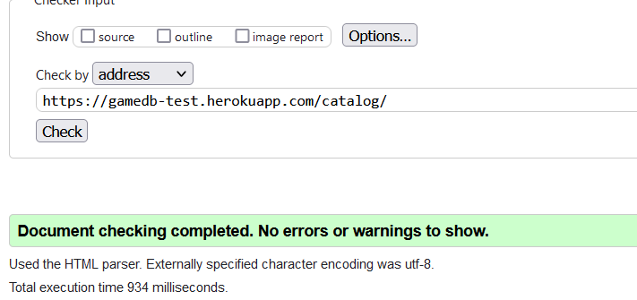
  

  
Game Description Page Validation

  
  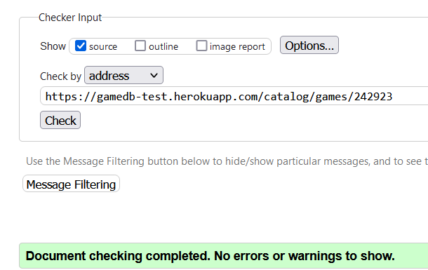
  

  
Profile Page Validation

  
  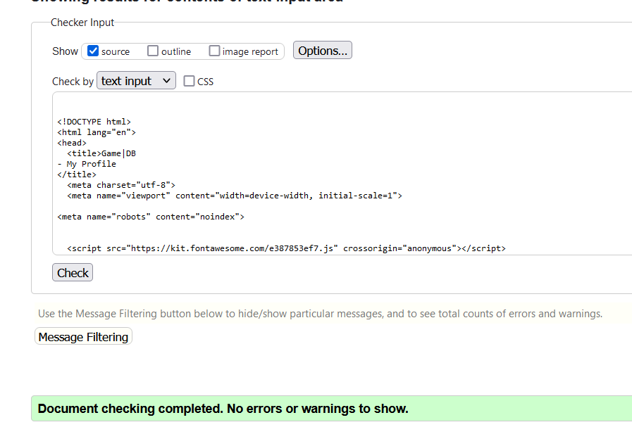
  

  
Profile Update Page Validation

  
  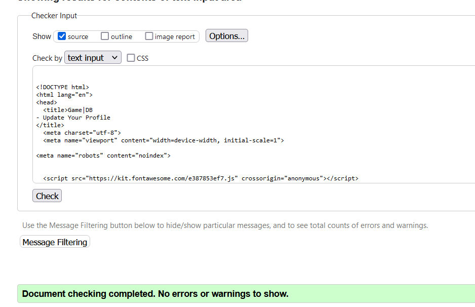
  

  
Password Change Validation

  
  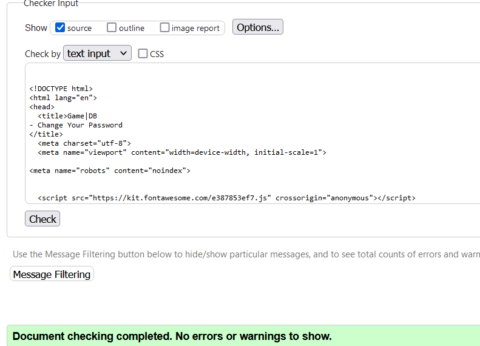
  

  
Profile Update Validation

  
  
  

  
Login Validation

  
  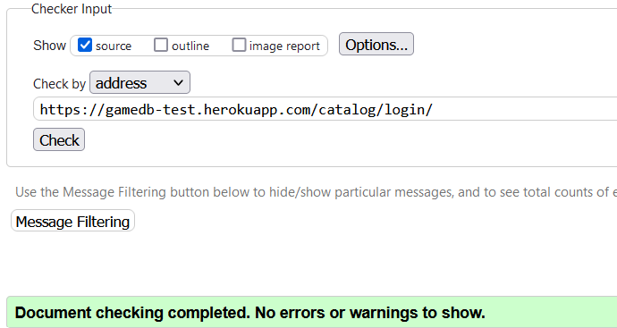
  

  
Reviews & Comments Page Validation

  
  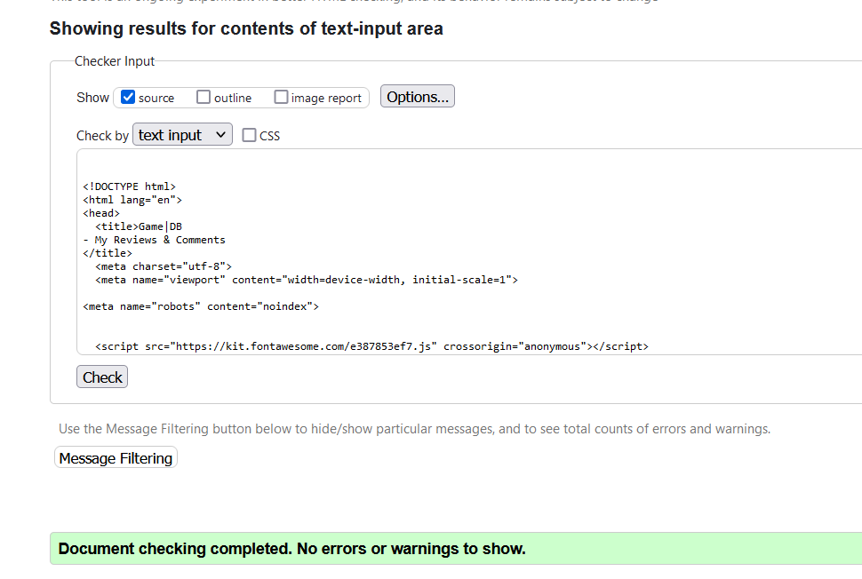
  

  
Publisher Items Validation

  
  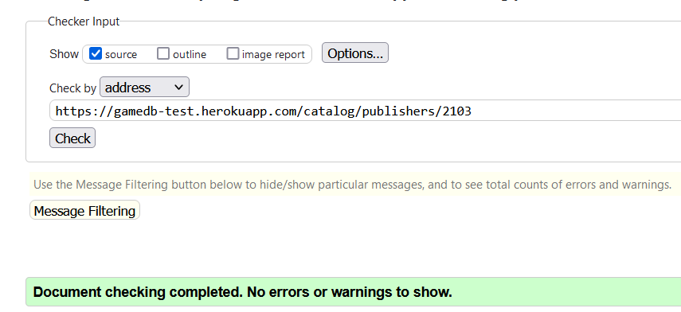
  

  
Publishers List Validation

  
  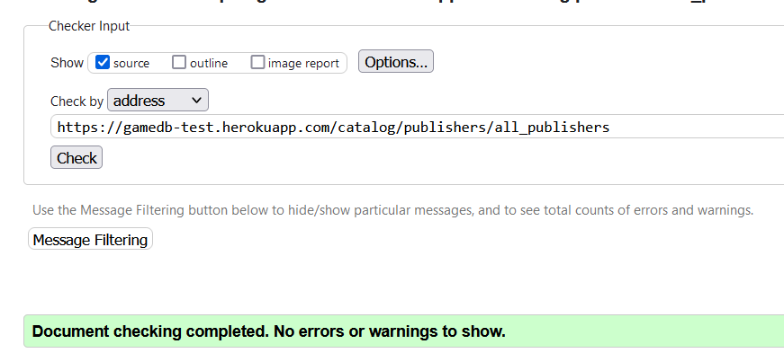
  

  
Publisher Items Validation

  
  
  

  
Developers List Validation

  
  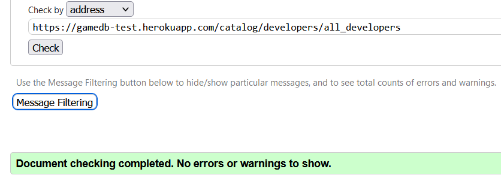
  

  
Developer Items Validation

  
  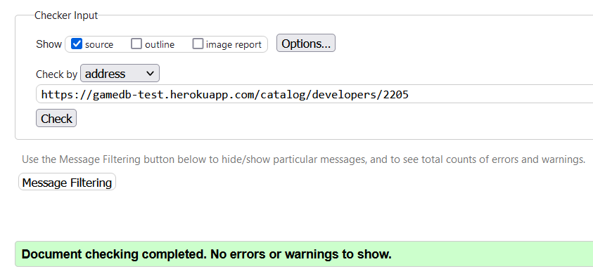
  

  
Genre List Validation

  
  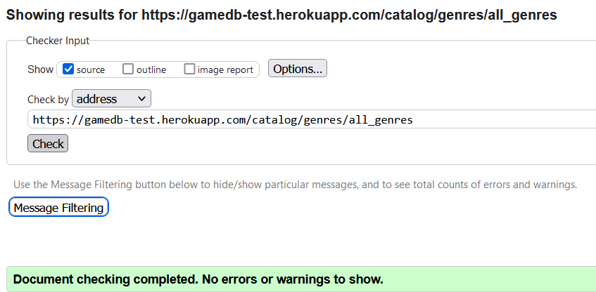
  

  
Genre Items Validation

  
  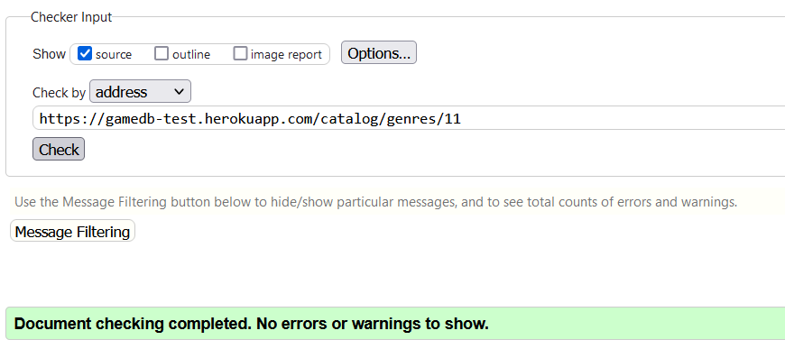
  

### CSS Validation

The CSS was run through the W3C CSS validator to ensure no errors were found and the results are as follows

  
CSS Validation

  
  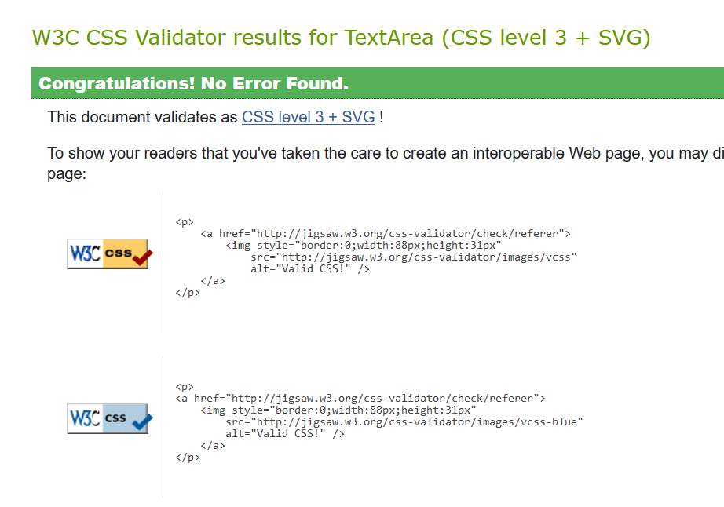
  

### Lighthouse Testing

All pages were put through Lighthouse testing in both Mobile & Desktop tests. There are some pages that have lower scores in SEO which are behind authentication barriers such as the profile and related pages. These pages have all been set to noindex in there meta tags to prevent search indexing also.

